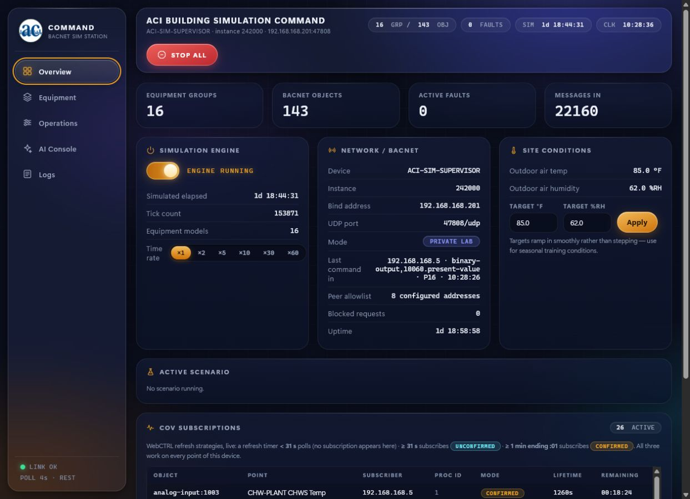
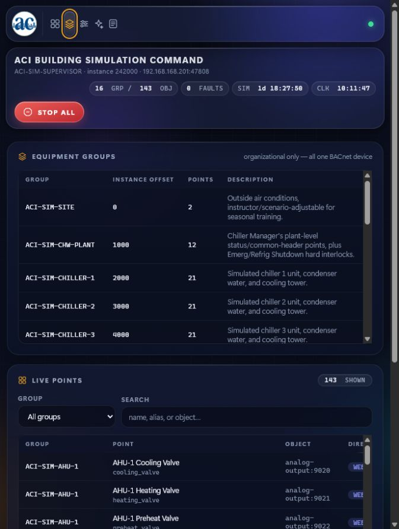
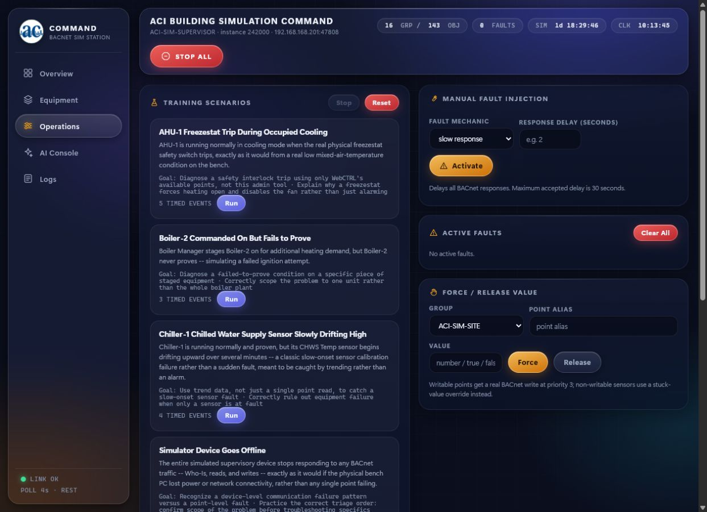
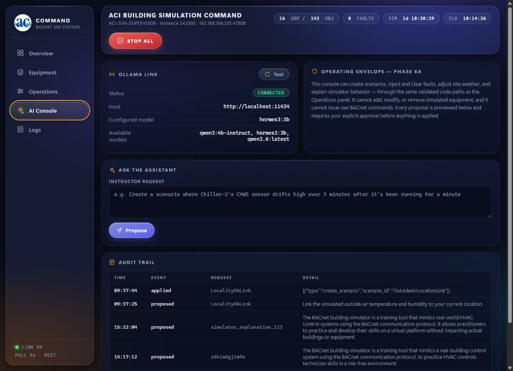
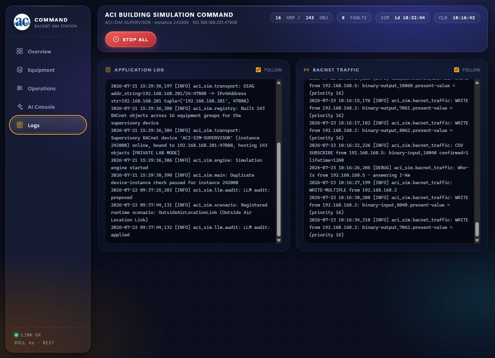

# Live-Bench Audit and Hardening Review — 2026-07-23

## Scope and authority

This review used the working copy on the test-bench laptop as the
authoritative baseline. The Windows service, live BACnet/IP traffic, WebCTRL
peer activity, object count, dashboard behavior, configuration files, test
suite, and operator documentation were inspected before changes were made.

The verified live topology is:

- Simulator device: `ACI-SIM-SUPERVISOR`, instance `242000`
- Simulator BACnet/IP endpoint: `192.168.168.201:47808`
- Dashboard endpoint: `127.0.0.1:8001`
- Allowed BACnet peers and writers: `192.168.168.1` through `.7`, plus
  `192.168.168.200`
- Equipment groups / BACnet objects: `16 / 143`

Port `8000` is owned by an unrelated Windows HTTP service on this laptop and
must not be used as the dashboard endpoint.

## Resolved in this pass

| Area | Risk found | Resolution |
|---|---|---|
| Configuration | Unknown JSON fields and invalid ranges could be accepted silently | Strict Pydantic models now reject extra fields and enforce point, range, direction, commandability, peer, and private-lab invariants |
| Network policy | Older scripts and docs omitted active bench peers | Launch, firewall, topology tests, and documentation now use the verified `.1`–`.7` plus `.200` policy |
| Engine lifecycle | Rapid stop/start could leave overlapping tick tasks | Lifecycle operations now share an async lock and cancel/await the exact task; a regression test covers the race |
| API safety | Empty force values could become `0`; invalid target/fault combinations were weakly checked | API validation now rejects empty or incompatible values and validates equipment, alias, mechanism, rate, and delay fields |
| AI action approval | A proposal could be altered or replayed at the apply endpoint | Proposals now receive a short-lived, one-use token bound to a SHA-256 digest of the validated action bundle |
| Shutdown | Background checks, engine tasks, and transports were not all guaranteed to close | Lifespan cleanup is exception-safe and explicitly cancels/awaits background work |
| Logging | Reconfiguration could duplicate or leak handlers | Existing handlers are removed and closed; idempotence is tested using an isolated log directory |
| Packaging | The local virtual environment referenced a removed Python runtime | The live environment was repaired; Windows scripts now verify Python 3.11 and imports before launch or service install |
| Dependencies | Runtime and test dependencies were broadly constrained or mixed | Runtime versions are exact and development/test dependencies are separated |
| Dashboard | Wrong endpoint, stale data, hidden aliases, ambiguous controls, generic fault fields, unsafe empty forces, and weak modal navigation | Endpoint references, stale-state banner, filtering, aliases, mechanic-specific forms, validation, keyboard focus, compact navigation, polling, and AI previews were corrected |

The automated result after these changes is **73 passed**. One dependency
deprecation warning remains: the installed FastAPI/Starlette test client still
uses the legacy `httpx` adapter. It does not affect runtime operation, but the
test stack should migrate when the upstream compatibility path is stable.

## Post-change cutover evidence

The `ACIBACnetSimulator` NSSM service was restarted through the reviewed
administrator script after the test suite passed. The fresh process returned
the expected 16 groups / 143 points with the engine running and no active
faults or scenario. WebCTRL writes from `192.168.168.2` resumed immediately,
blocked requests remained zero, and all 26 COV subscriptions repopulated after
the normal controller resubscription interval.

## Open risks and recommended next work

1. Add an instructor authentication boundary or read-only operator profile
   before allowing any remote dashboard access. Loopback-only access is the
   current primary control.
2. Run the service under a dedicated least-privilege Windows account instead
   of `LocalSystem`, then revalidate UDP binding, logs, and configuration
   access.
3. Centralize the service-by-service BACnet request policy in one explicit
   APDU matrix. The source allowlist is enforced at transport ingress, but
   service coverage should remain easy to audit.
4. Verify the installed Windows Firewall rule after each topology change;
   keeping the script correct is not proof that the live rule matches.
5. Install a standalone CPython 3.11 runtime. The repaired environment
   currently depends on the compatible interpreter bundled with pgAdmin.
6. Resolved in the command-center expansion: the active dashboard is split
   into `static/command-center.html`, `static/styles.css`, and
   `static/app.js`. The prior page remains available as a rollback reference.
7. Add acceptance criteria and automatic scoring to the six training
   scenarios.
8. Keep BACnet UDP `47808`, Ollama `11434`, Windows file sharing, and
   state-changing REST endpoints off the public internet.

## Dashboard review

1. **Overview:** operator-facing status is grouped into network, simulation,
   weather, scenario, and COV panels; stale REST data now produces a visible
   warning instead of silently presenting old values.

   

2. **Equipment:** all 143 objects remain searchable, with live values,
   readable aliases, result counts, and state badges.

   

3. **Operations:** fault fields change with the selected mechanism, target
   aliases are searchable, destructive actions are confirmed, and scenario
   replacement is explicit.

   

4. **AI Console:** proposed actions are shown as a reviewable table with raw
   JSON available on demand; apply requires the bound one-time proposal
   token.

   

5. **Logs:** application and BACnet traffic streams are separate, readable,
   and only polled while the view is active.

   

## Local and remote agent feasibility

The inspected laptop is a ThinkPad L14 Gen 4 AMD with a Ryzen 3 PRO 7330U,
integrated graphics, one 8 GB DDR4-3200 module, and a 256 GB NVMe drive.
Ollama `0.32.1` and Hermes Agent `0.18.2` are installed.

- The installed 23 GB `qwen3.6` model is not viable on this machine.
- A 3B or 4B quantized model can be used for constrained experiments, but
  Windows, WebCTRL, the simulator, and an agent runtime compete for the same
  limited memory. It is not a reliable full-agent configuration at 8 GB.
- The best current arrangement is a local Hermes tool/runtime layer with a
  cloud inference provider, while keeping the dashboard loopback-only and
  BACnet isolated to the bench network.
- A memory upgrade to 32 GB would make local 3B/4B testing more practical,
  though CPU-only inference will remain slower than cloud inference.
- A remote agent is feasible through a private overlay network and a narrow,
  authenticated, preferably read-only gateway. Do not expose the simulator,
  Ollama, a shell, or file shares directly to the internet.

The companion Obsidian vault contains the detailed hardware inventory,
threat model, hybrid-agent runbook, architecture maps, point catalog, training
guides, templates, and evidence notes.
