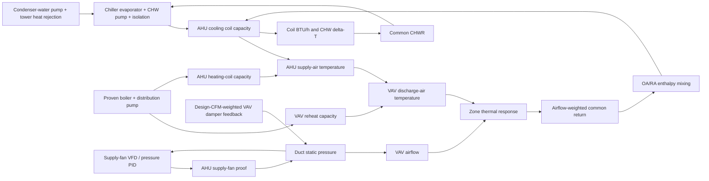

# HVAC Realism and Parent-Equipment Model

## Purpose and authority boundary

This simulator models how commercial HVAC equipment physically responds to
commands from WebCTRL. WebCTRL remains the control authority for start/stop,
airflow setpoints, VAV damper commands, reheat-valve commands, plant enables,
resets, and AHU heating/cooling valve positions. The simulator does not
overwrite those commands with an internal sequence. AHU-1 has one writable
`sa_temp_setpoint` analog value for the effective WebCTRL supply-air
temperature setpoint; there is intentionally no separate heating setpoint.

The behavior is informed by ASHRAE Guideline 36 and commercial HVAC design
references, but it is a training model rather than a claim of formal Guideline
36 compliance, an equipment-selection calculation, or a project sequence of
operations.

## Parent dependency chain

| Downstream result | Required parent state | Response when unavailable |
|---|---|---|
| Chilled-water flow | CHW pump running and isolation valve open | Unit contributes no common-header flow |
| AHU mechanical cooling | Chilled-water plant has usable flow and CHWS colder than entering air by the coil approach | Cooling-coil command cannot create cooling; residual cold water may provide temporary cooling after compressor shutdown |
| AHU heating | Hot-water plant has proven capacity and usable HWS | Heating-valve command cannot create heat |
| AHU economizer | Reliable OA/RA conditions, suitable outdoor enthalpy, cooling benefit, and no safety/low-limit override | The raw WebCTRL request remains visible while the effective damper is limited to minimum ventilation or fully closed |
| AHU duct static | Supply fan command and proof, VFD speed, and aggregate VAV damper relief | Pressure and VFD feedback are exactly zero while the loop is inactive |
| AHU high-static safety | Automatic high-static switch is healthy and not bypassed | 4.0-in. H2O trip latches and stops both fans before the modeled duct-class limit |
| AHU freezestat protection | Automatic freezestat is healthy and not bypassed | Low cooling-coil entering air latches the protective shutdown/heat sequence |
| VAV airflow | AHU proof, duct static, damper opening, and a meaningful airflow target | Airflow decays toward zero |
| VAV reheat | Boiler plant has proven distribution capacity and usable HWS | Valve command cannot create heat |
| Zone temperature | Outdoor/envelope load, internal load, actual airflow, and actual DAT | Zone drifts from real loads rather than toward a fixed 72 degrees F |
| Zone humidity | Supply/OA moisture, infiltration, adjacent mixing, people, and moisture storage | RH changes slowly; reheat changes dry bulb but not moisture ratio |

An upstream AHU outage inhibits VAV airflow-mismatch alarms instead of
creating seventeen misleading terminal-unit failures. The VAVs still expose
their loss of air delivery in the inspector.

## Coupled thermodynamic path

The thermal model is bidirectional. Parent equipment constrains its children
immediately, while the completed child load returns to the parent on the next
one-second simulation tick. This explicit transport lag avoids an algebraic
loop while preserving energy through the full chain:

1. Each VAV advances a physical zone heat/moisture balance from its actual
   airflow and discharge-air state.
2. AHU-1 mass-weights zone enthalpy and humidity ratio by actual terminal
   return airflow to obtain the common return state.
3. Outdoor and return streams mix by conserved enthalpy and humidity ratio.
4. The cooling coil calculates total sensible-plus-latent load as
   `Qair = 4.5 x CFM x (hentering - hleaving)` in Btu/h.
5. The same load appears on the water side as
   `Qwater = 500 x GPM x (CHWR - CHWS)`.
6. The common return header includes the load diluted by primary/bypass flow,
   and each connected chiller receives that return temperature.
7. A proven compressor removes only the heat required to reach setpoint, up
   to `500 x design GPM x design delta-T`; an off compressor with circulation
   passes warming return water through without refrigeration.

Consequently, a running unloaded chiller approaches zero evaporator delta-T.
With the compressor off, an open coil valve, and a running CHW pump, CHWR is
warmer than CHWS while useful heat transfer remains and the whole loop warms
until the water is no longer cold enough to cool the air. With no flow or a
closed coil valve, a meaningful load delta-T is not fabricated.

VAV-1 and VAV-2 still leave their zone-temperature BACnet points under their
external physical controllers. Internally, they now carry shadow zone states
so their 2,230 square feet of envelope, solar, people, and ventilation load
are not omitted from AHU return air.

## Temperature and flow behavior

- `AHU-1 SA Temperature Setpoint` is the single commandable BACnet
  `analog-value:9001`. WebCTRL may reset it from **45-95 degrees F**; its
  relinquish default is **55 degrees F**. The model uses the setpoint to
  report requested mode and temperature error, but it does not secretly
  reposition either coil valve. This preserves WebCTRL as the controller
  and makes locked or mistuned commands visible during training.
- With the supply fan proven, a 0% economizer command still admits a
  representative **15% minimum outdoor air**. The mixed-air load therefore
  changes with outside temperature instead of treating a closed economizer
  as zero ventilation.
- `AO:9023` remains the raw WebCTRL economizer request. The simulator
  separately calculates the effective stroke so a locked or mistuned BAS
  command remains diagnosable without forcing unsuitable outdoor air through
  the unit.
- Chilled-water supply reset is constrained to **38-54 degrees F**; the
  nominal training value is **44 degrees F**.
- An enabled AHU cooling coil targets approximately **CHWS + 10 degrees F**,
  then the supply fan adds approximately **2 degrees F**. With 44-degree
  chilled water, the normal AHU discharge band is approximately **52-58
  degrees F**.
- Coil leaving-air targets are capacity-limited by actual terminal CFM,
  available CHW flow, valve position, and a 14-degree F maximum modeled
  coil-water rise. Reported coil BTU/h and coil CHWR obey the same air/water
  conservation equation.
- Cooling- and heating-valve actuators respond with 60- and 45-second time
  constants, respectively; the supply-air sensor/coil response has a
  45-second time constant. The staged response is intentional so a command
  change does not teleport the supply temperature.
- Hot-water supply reset is constrained to **100-200 degrees F**; the
  conventional training default is **180 degrees F**.
- The AHU heating coil uses a characterized-valve approximation and a
  **20.5-degree F design rise** at full available hot-water capacity. At
  approximately 70-degree F outside air, 15% minimum OA, and 72-degree F
  return air, a **48-52% heating-valve command** settles near an
  **85-degree F** supply-air setpoint. At 40-degree F outside air the same
  50% command settles near 80 degrees F; approximately 72% is needed to
  return to 85 degrees F. This represents the extra ventilation load in
  cold weather without oversizing the normal-condition response.
- VAV discharge air is bounded by actual hot-water availability and a
  **95-degree F** safety-oriented training cap.
- VAV airflow uses a square-root pressure relationship. The actual flow is
  bounded by both damper/static capacity and the WebCTRL airflow setpoint.
- AHU-1 duct static uses a fan-law pressure term proportional to fan speed
  squared and a relief term based on the design-CFM-weighted average of all
  17 VAV damper feedback values. At fixed speed, opening dampers lowers
  pressure and closing dampers raises it. The direct-acting PID increases
  supply-fan speed when pressure falls below the WebCTRL setpoint.
- The duct-static sensor is represented two-thirds down the common main on a
  straight section immediately upstream of the first VAV takeoff. WebCTRL
  writes `AV:9002` (0.25–2.00 in. H2O); the simulator publishes `AV:9003`
  actual pressure over 0.00-10.00 in. H2O and `AV:9004` fan-speed feedback.
- AHU-1 publishes mixed-air humidity at `AI:9005`, supply-air humidity at
  `AI:9006`, and cooling-coil entering-air temperature at `AI:9007`.
  Existing `AI:9001` remains the true mixed-air temperature at the mixing
  plenum; preheat leaving/cooling-coil entering temperature is separate.
- The virtual-zone model solves the analytical heat balance
  `Ceff dT/dt = internal + solar + envelope + infiltration + mixing
  + 1.08 x actual CFM x (DAT - zone temperature)`. Effective thermal
  capacitance represents air, partitions, furnishings, and interior mass.
  This keeps trends stable at accelerated simulator speeds without making a
  zone jump directly toward DAT or a comfort setpoint.
- With AHU proof absent, supply CFM is forced to zero in the heat balance.
  Envelope, infiltration, solar, internal, and adjacent-space loads continue,
  so a space changes slowly instead of freezing or receiving fictitious air.
- Virtual-zone maximum airflow spans **400–2,120 CFM** and area spans
  **600–2,400 square feet**. Each zone has different thermal mass, envelope
  UA, solar peak, occupancy/internal load, and mixing, so two zones do not
  recover at the same rate merely because they have the same command.
- Humidity is stored as humidity ratio and integrated from supply-air
  moisture, outside infiltration, adjacent mixing, and occupant latent gain.
  The published Zone Humidity AIs for VAV-3 through VAV-15 therefore move
  over hours, not seconds. AHU wet-coil cooling can remove moisture; terminal
  reheat changes relative humidity through dry-bulb temperature only.

The default zone heating/cooling setpoints remain the user-requested
**70/72 degrees F** and are configurable. This is intentionally a narrow
training deadband; many occupied commercial sequences use a wider deadband.

Remaining sizing approximations are intentional and configurable: each
fixed-speed chiller circuit is 300 GPM with a 10-degree F design evaporator
rise (1,500,000 Btu/h, or 125 refrigeration tons), pressure drop is not yet
solved from a pipe network, and terminal return flow currently equals primary
supply flow because per-zone exhaust/transfer-air paths are not configured.

## Airside economizer availability

The default changeover method is differential (dual) enthalpy. Outdoor-air
enthalpy must be at least 1 Btu/lb below return-air enthalpy to enable free
cooling. The state holds through a dead band and disables when OA enthalpy is
1 Btu/lb above RA. A 75-degree-F dry-bulb ceiling and 55/57-degree-F OA
dew-point enable/disable limits prevent warm or humid air from being treated
as free cooling.

Sensor reliability selects the safest usable fallback without inventing a
good reading:

1. dual enthalpy when OA and RA temperature/humidity are reliable;
2. single enthalpy with a 28 Btu/lb high limit when the return-air pair is
   unavailable;
3. differential dry bulb with 65/67-degree-F hysteresis when OA humidity is
   unavailable but OA/RA temperature remain reliable;
4. fixed dry bulb when only OAT is reliable; and
5. economizer unavailable when OAT is unreliable.

Unsuitable weather limits the effective economizer stroke to 0%, which means
the normal 15% ventilation minimum while the supply fan is proven. Fan-off,
hard-safety, and mixed-air-low-limit states close outdoor air fully. The
mixed-air limit closes below 45 degrees F and releases at 47 degrees F.

When outdoor air is suitable and cooling is beneficial, the effective damper
follows the WebCTRL request. If it remains at least 95% open for 180 simulated
seconds while supply air is still above setpoint, integrated economizer
cooling is allowed so the chilled-water coil can provide the balance. The
command-center API publishes method, availability, OA/RA enthalpy, enthalpy
delta, OA dew point, requested/effective position, limiting reason, proof
timer, and FDD flags. These are computed diagnostics rather than new BACnet
objects, so the catalog remains 329 points.

## Air-delivery animation contract

The command-center API publishes one air-delivery snapshot for each VAV:
active state, display mode, conditioning source, actual CFM, design-flow
fraction, discharge temperature, zone temperature, temperature delta,
sensible effect, and parent dependencies.

Air is considered active when AHU proof is present and actual airflow is at
least the greater of **50 CFM** or **10% of design flow**. A one-degree
hysteresis prevents rapid color changes.

| Display mode | Physical test | Meaning |
|---|---|---|
| Blue cooling air | Active air, DAT at least 2 degrees F below zone, and a real mechanical-cooling or economizer source | The space is receiving useful cooling |
| Red heating air | Active air, DAT at least 2 degrees F above zone, hot-water distribution available, and reheat valve above 5% | The space is receiving useful heat |
| White/gray ventilation air | Active air without a qualifying heating or cooling source | The space has airflow but is not materially conditioned |
| Off | No proven/meaningful air delivery | No plume is shown |

The image plume uses a subtle looping opacity/translation animation. Space
geometry in `config/building_layout.json` controls its placement, size, and
angle independently for all seventeen VAV zones. The display is derived from
physical outputs, not from color commands.

## Diagnostics

- Command/status mismatches for chillers, cooling towers, pumps, boilers, the
  AHU, and the exhaust fan must persist for **15 wall-clock seconds** before a
  failure outline is shown.
- A VAV airflow mismatch must remain outside an inclusive **plus or minus
  25%** band around its airflow setpoint for **15 wall-clock seconds**.
- A VAV airflow diagnostic is **inhibited** when the AHU cannot provide air.
- AHU-1 flags simultaneous material cooling and heating commands when both
  valves remain above **10%** outside a normal changeover. A cross-ramp gets
  one 60-second simulated actuator-travel window, including residual physical
  travel after the outgoing command reaches zero. Persistent overlap then
  enters the standard 15-real-second tracking timer and outlines AHU-1 in red
  as an energy-waste failure, with both commands shown and a prompt to check
  WebCTRL priority locks. The thermal model still applies both coil effects,
  because that is the physical waste the diagnostic is meant to expose.
- The 15-second command/status and airflow-diagnostic timers use wall-clock
  time so simulator speed does not shorten the technician's observation
  window.
- The high-static/freezestat exposure timers are a separate class and use
  **simulated time**, so a 20x or 60x lesson accelerates the modeled
  mechanical exposure without changing its simulated duration.
- With the high-static safety healthy, 4.0 in. H2O latches
  `automatic_high_static_trip` and stops both fans. Only the restricted
  instructor safety-bypass/failure mechanic permits pressure to cross the
  representative 5.0-in. H2O training duct-class limit and latch
  `duct_structural_failure`.
- With the freezestat healthy, low cooling-coil entering air latches a
  protective shutdown. If the freezestat is explicitly bypassed and entering
  air remains below 32 degrees F, the freeze timer is 20 simulated minutes
  without useful chilled-water flow or 60 simulated minutes with cooling
  valve open and chilled-water flow proven. Freeze and burst/flood alarms
  latch until Restart.
- Chiller and boiler default proof sequences complete in ten seconds, while
  their water temperatures continue to respond on slower thermal time
  constants. This separates equipment proof from thermal readiness and avoids
  false showcase alarms.

## WebCTRL sequence guidance

For AHU-1, use the one supply-air setpoint as the active discharge target.
When that target is below neutral mixed-air-plus-fan temperature, sequence
the heating valve closed before modulating cooling. When the target is above
neutral, sequence cooling closed before modulating heating. A brief
cross-ramp is acceptable for actuator travel; steady overlap is not.

For a pressure-independent VAV with hot-water reheat, the recommended
WebCTRL-side sequence is dual-maximum:

1. During occupied cooling demand, increase airflow setpoint from occupied
   minimum toward cooling maximum and modulate the damper to track flow.
2. In the deadband, return toward occupied minimum and close reheat.
3. During initial heating demand, hold occupied minimum airflow and modulate
   the reheat valve.
4. Only on stronger heating demand, and with sufficiently warm discharge air,
   increase airflow toward the configured heating maximum.

An optional autonomous demo controller could be added later, but it must be
disabled whenever BACnet priority writes are active and always disabled for
VAV-1 and VAV-2, whose zone temperatures come from the wall controllers.

## Remaining realism backlog

### Priority 1

- Cooling-tower VFD response, bypass-valve behavior, and condenser-water reset
- A first-class WebCTRL occupancy/schedule input for people, lighting,
  equipment, ventilation minimums, and after-hours infiltration
- A climate-specific economizer high-limit profile and a calibrated coil
  latent-capacity curve
- Configurable duct leakage and independently calibrated near-fan versus
  downstream static-pressure profiles

### Priority 2

- Equipment power, energy, efficiency curves, and trend-ready load metrics
- Weather profiles and solar/orientation load diversity
- Sensor noise, calibration drift, actuator hysteresis, and valve leakage
- Zone CO2 and demand-controlled ventilation
- Heat-capacity and transport-delay calibration from recorded WebCTRL trend
  data

## Reference basis

- [ASHRAE duct construction and pressure classes](https://handbook.ashrae.org/Handbooks/S16/SI/s16_ch19/s16_ch19_si.aspx)
- [Johnson Controls duct pressure control and shutdown](https://docs.johnsoncontrols.com/bas/r/Johnson-Controls/en-US/Smart-Equipment-Controls-Sequence-of-Operation-Technical-Bulletin/5.0/VAV-sequences/Duct-pressure-control)
- [Johnson Controls/PENN A11 low-temperature cutout mounting](https://docs.johnsoncontrols.com/bas/r/PENN-Controls/en-US/A11-Series-Low-Temperature-Cutout-Control-Installation-Guide/J/Mounting/Mounting-considerations)
- [Johnson Controls/PENN A70 low-temperature cutout application](https://docs.johnsoncontrols.com/bas/r/PENN-Controls/en-US/A70BA-A70GA-and-A70HA-Temperature-Control-Technical-Bulletin/J/Application?contentId=fVnmDSy6W063XApx5jbxvQ)
- [ASHRAE Guideline 36 VAV terminal-unit addendum](https://www.ashrae.org/file%20library/technical%20resources/standards%20and%20guidelines/standards%20addenda/g36_2018_h_galley_20200817.pdf)
- [ASHRAE Guideline 36-2021 Addendum p: SAT setpoint and coil-valve monitoring](https://www.ashrae.org/file%20library/technical%20resources/standards%20and%20guidelines/standards%20addenda/g36_2021_p_20240229.pdf)
- [Johnson Controls discharge-air control sequence](https://docs.johnsoncontrols.com/bas/api/khub/documents/G3Tdgk5ET9FVyaQU0r937Q/content)
- [Johnson Controls discharge-air-temperature cooling control](https://docs.johnsoncontrols.com/airhandling/r/YORK/en-US/CRAH-and-Fan-Wall-Unit-OptiView-Commissioning-Guide/001/Cooling-control/Discharge-air-temperature-control?contentId=FqAhk7zu6vrjYhsJkO0oOQ)
- [Belimo characterized control-valve technology](https://www.belimo.com/mam/americas/technical_documents/Support%20material/belimo-characterized-control-valve-technology.pdf)
- [Lawrence Berkeley National Laboratory dual-maximum VAV sequence](https://build.openmodelica.org/Documentation/Buildings.Controls.OBC.ASHRAE.G36.TerminalUnits.Reheat.Subsequences.DamperValves.html)
- [ASHRAE Handbook: Variable-Air-Volume Systems](https://handbook.ashrae.org/Handbooks/A19/SI/a19_ch48/a19_ch48_si.aspx)
- [ASHRAE Handbook: Nonresidential Cooling and Heating Load Calculations](https://handbook.ashrae.org/Handbooks/F25/SI/F25_Ch18/f25_ch18_si.aspx)
- [PNNL Advanced VAV System Design Guide](https://www.pnnl.gov/main/publications/external/technical_reports/pnnl-19004.pdf)
- [DOE EnergyPlus Zone and Air System Integration](https://bigladdersoftware.com/epx/docs/24-1/engineering-reference/basis-for-the-zone-and-air-system-integration.html)
- [DOE EnergyPlus Moisture Predictor/Corrector](https://bigladdersoftware.com/epx/docs/8-6/engineering-reference/moisture-predictor-corrector.html)
- [PNNL Medium Office Prototype](https://www.pnnl.gov/main/publications/external/technical_reports/pnnl-20214.pdf)
- [Trane Intelligent VAV Systems catalog](https://www.trane.com/content/dam/Trane/Commercial/north-america/products-systems/systems/APP-PRC010-EN.pdf)
- [Price SDV installation manual](https://priceindustries.com/wp-content/uploads/Assets/literature/manuals/section%20a/sdv-manual.pdf)
- [PNNL occupancy-based thermostat controls](https://www.pnnl.gov/main/publications/external/technical_reports/PNNL-26348.pdf)
- [LBNL Guideline 36 multi-zone AHU setpoints](https://simulationresearch.lbl.gov/modelica/releases/v12.1.0/help/Buildings_Controls_OBC_ASHRAE_G36_AHUs_MultiZone_VAV_SetPoints.html)
- [ASHRAE Guideline 36 chiller-plant addendum](https://www.ashrae.org/file%20library/technical%20resources/standards%20and%20guidelines/standards%20addenda/g36_2018_x_20210709.pdf)
- [ASHRAE Guideline 36 hot-water-plant addendum](https://www.ashrae.org/file%20library/technical%20resources/standards%20and%20guidelines/standards%20addenda/g36_2018_y_20210709.pdf)
- [Trane waterside system engineering guidance](https://www.trane.com/content/dam/Trane/Commercial/global/products-systems/education-training/engineers-newsletters/waterside-design/en20-3.pdf)
- [PNNL air-handling-system guidance](https://www.pnnl.gov/sites/default/files/media/file/pnnl_sa_84186.pdf)
- [GSA P100 Facilities Standards](https://www.gsa.gov/cdnstatic/2010_P100_FacilitiesStandards.pdf)
